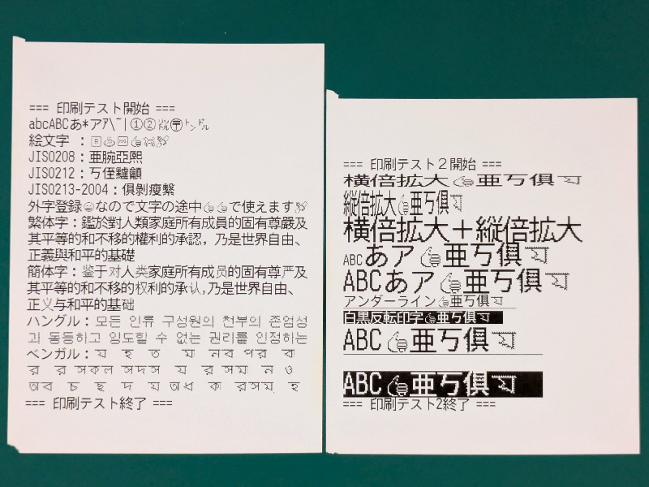

# TM88PLUS

WIP

----

This repository contains the `TM88IV` class, originally part of the [WPT](https://github.com/hatotank/WPT) project. The `TM88IV` class has been extracted for easier maintenance and reuse as a standalone library.

## Features
- Japanese and emoji printing support for TM88IV (Japanese model) printers
- Support for JIS character sets (JIS0212, JIS0213)
- External character (user-defined character) registration (ESC/POS, LRU management)



## Required Python Packages

- python-escpos
- Pillow
- emoji

A `requirements.txt` is provided. You can install all dependencies with:

```
pip install -r requirements.txt
```

## How to Obtain JIS Data and Fonts

This class requires the following JIS data files and font files:

### JIS Data Files
- JIS0201.TXT: http://unicode.org/Public/MAPPINGS/OBSOLETE/EASTASIA/JIS/JIS0201.TXT
- JIS0208.TXT: http://unicode.org/Public/MAPPINGS/OBSOLETE/EASTASIA/JIS/JIS0208.TXT
- JIS0212.TXT: http://unicode.org/Public/MAPPINGS/OBSOLETE/EASTASIA/JIS/JIS0212.TXT
- JIS0213-2004.TXT: https://raw.githubusercontent.com/hatotank/WPT/refs/heads/main/JIS0213-2004.TXT

### Font Files
- NotoSansJP-Medium.otf: https://github.com/notofonts/noto-cjk/releases
- OpenMoji-black-glyf.ttf: https://github.com/hfg-gmuend/openmoji/releases
- unifont_jp-16.0.03.otf: https://unifoundry.com/unifont/

Please place these files in appropriate locations such as `tests/data/` and `tests/fonts/` directories.

## Sample Code

The repository includes `tests/test_tm88iv.py`, which contains comprehensive test code covering the main features of the TM88IV class. This can also serve as sample code for usage and verification.

The test code includes functionality to automatically download and extract the required JIS data and font files. On the first run, all necessary files will be prepared automatically, greatly simplifying setup.

## License
This project inherits the license from the original [WPT](https://github.com/hatotank/WPT) project.